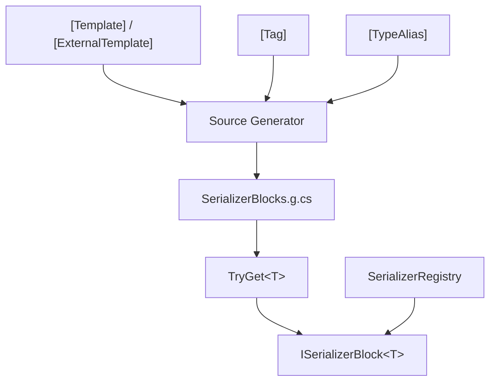

# API 参考

编译期 source generator 与运行时注册表的完整接口。

## Attributes

| 类型 | 说明 |
|------|------|
| [`[Template]`](./template-attribute) | 标记 struct/class，声明序列化布局模板 |
| [`[ExternalTemplate]`](./external-template-attribute) | 外部类型模板覆盖，支持 BCL/第三方类型 |
| [`[Tag]`](./tag-attribute) | 枚举成员标签，运行时 `tag → enum value` 映射 |
| [`[TypeAlias]`](./type-alias-attribute) | 类型别名，将模板中的自定义名称映射到 C# 内置类型 |
| [`[TemplateIgnore]`](../guide/diagnostics#ssr004---missing-template-dependency) | 跳过字段序列化 |

## Runtime

| 类型 | 说明 |
|------|------|
| [`SerializerRegistry`](./serializer-registry) | 13 种内置类型的零分配 span 扫描器与发射器 |
| [`SerializerBlocks`](./serializer-blocks) | 双向序列化器块注册表，`TryGet<T>` 获取 Scan + Emit 能力 |

## 类型关系

