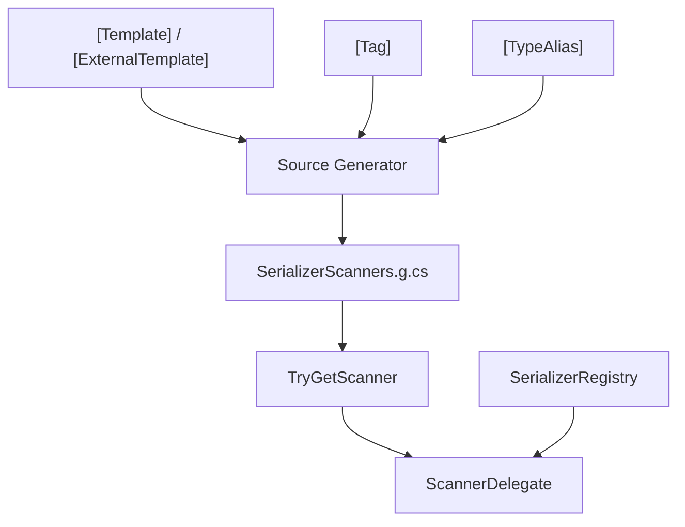

# API 参考

## Attributes

| Attribute | 目标 | 说明 |
|-----------|------|------|
| [`[Template]`](./template-attribute) | struct, class | 声明类型的文本模板 |
| [`[ExternalTemplate]`](./external-template-attribute) | assembly, class, struct | 为第三方类型声明模板 |
| [`[Tag]`](./tag-attribute) | enum field | 为枚举成员声明字符串标签 |
| [`[TypeAlias]`](./type-alias-attribute) | assembly | 注册类型别名 |

## Runtime

| 类型 | 说明 |
|------|------|
| [`SerializerRegistry`](./serializer-registry) | 12 种内置类型的零分配 span 扫描器 |
| [`SerializerScanners`](./serializer-scanners) | 扫描器注册入口，`TryGetScanner<T>` 获取生成的解析器 |

## 类型关系

