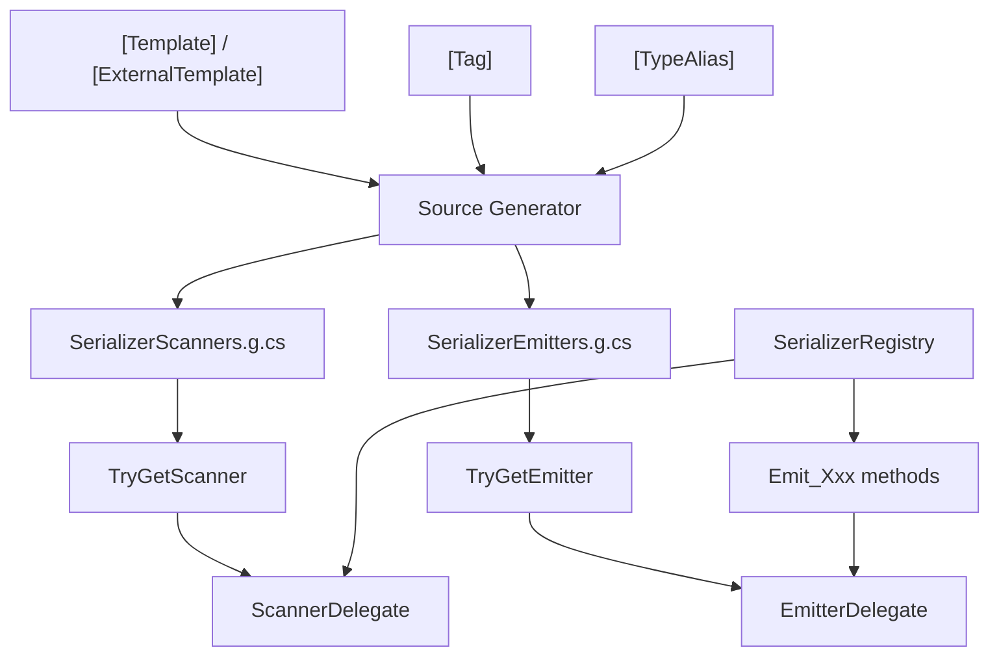

# API Reference

## Attributes

| Attribute | Target | Description |
|-----------|--------|-------------|
| [`[Template]`](./template-attribute) | struct, class | Declares a text template for the type |
| [`[ExternalTemplate]`](./external-template-attribute) | assembly, class, struct | Declares a template for a third-party type |
| [`[Tag]`](./tag-attribute) | enum field | Declares a string tag for an enum member |
| [`[TypeAlias]`](./type-alias-attribute) | assembly | Registers a type alias |
| [`[TemplateIgnore]`](../guide/diagnostics#using-templateignore-to-skip-fields) | field | Excludes a field from serialization, prevents SSR004 error |

## Runtime

| Type | Description |
|------|-------------|
| [`SerializerRegistry`](./serializer-registry) | Zero-allocation span scanners and emitters for 12 built-in types |
| [`SerializerScanners`](./serializer-scanners) | Deserialization registry entry point, `TryGetScanner<T>` |
| [`SerializerEmitters`](./serializer-emitters) | Serialization registry entry point, `TryGetEmitter<T>` |

## Type Relationships

