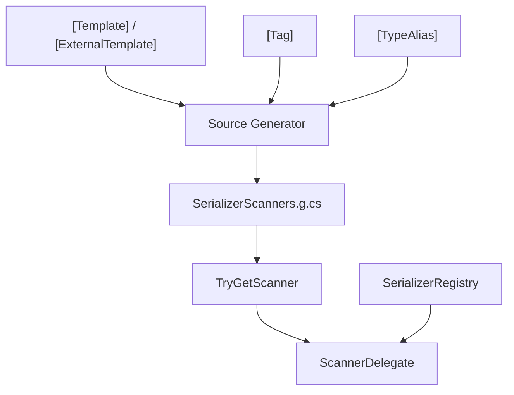

# API Reference

## Attributes

| Attribute | Target | Description |
|-----------|--------|-------------|
| [`[Template]`](./template-attribute) | struct, class | Declares a text template for the type |
| [`[ExternalTemplate]`](./external-template-attribute) | assembly, class, struct | Declares a template for a third-party type |
| [`[Tag]`](./tag-attribute) | enum field | Declares a string tag for an enum member |
| [`[TypeAlias]`](./type-alias-attribute) | assembly | Registers a type alias |

## Runtime

| Type | Description |
|------|-------------|
| [`SerializerRegistry`](./serializer-registry) | Zero-allocation span scanners for 12 built-in types |
| [`SerializerScanners`](./serializer-scanners) | Scanner registry entry point, `TryGetScanner<T>` |

## Type Relationships

