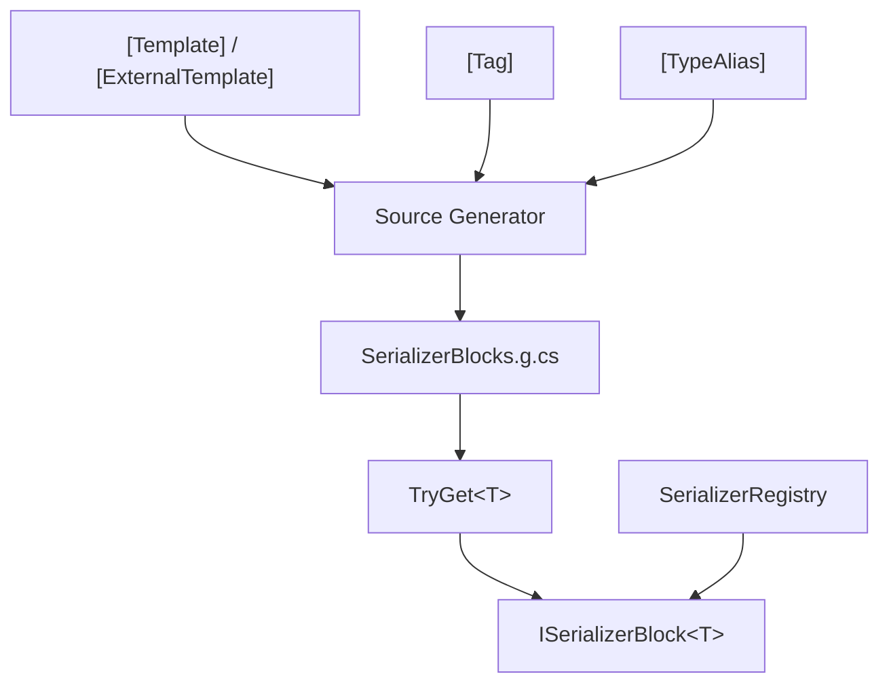

# API Reference

Complete interface for the compile-time source generator and runtime registries.

## Attributes

| Type | Description |
|------|-------------|
| [`[Template]`](./template-attribute) | Marks a struct/class, declares the serialization layout template |
| [`[ExternalTemplate]`](./external-template-attribute) | External type template override, supports BCL/third-party types |
| [`[Tag]`](./tag-attribute) | Enum member tag, runtime `tag → enum value` mapping |
| [`[TypeAlias]`](./type-alias-attribute) | Type alias, maps custom names in templates to C# built-in types |
| [`[TemplateIgnore]`](../guide/diagnostics#ssr004---missing-template-dependency) | Skips a field from serialization |

## Runtime

| Type | Description |
|------|-------------|
| [`SerializerRegistry`](./serializer-registry) | Zero-allocation span scanners and emitters for 17 built-in types |
| [`SerializerBlocks`](./serializer-blocks) | Bidirectional serializer block registry, `TryGet<T>` for Scan + Emit |

## Type Relationships

