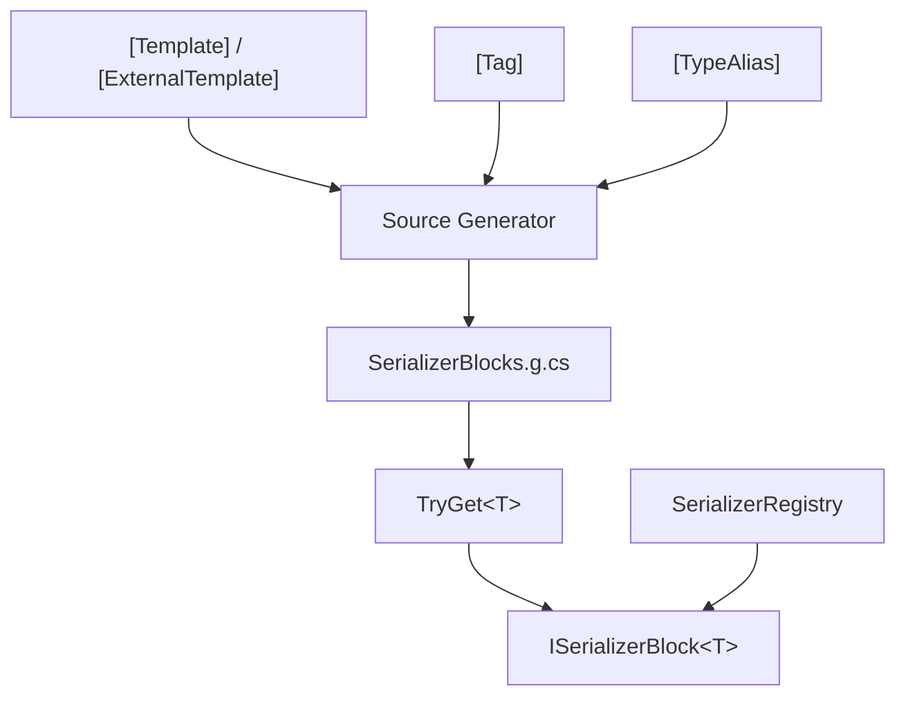

# API Reference

Complete interface for the compile-time source generator and runtime registries.

## Attributes

| Type | Description |
|------|-------------|
| [`[Template]`](./template-attribute) | Marks a struct/class, declares the serialization layout template |
| [`[ExternalTemplate]`](./external-template-attribute) | External type template override, supports BCL/third-party types |
| [`[Tag]`](./tag-attribute) | Enum member tag, runtime `tag → enum value` mapping |
| [`[TypeAlias]`](./type-alias-attribute) | Type alias, maps custom names in templates to C# built-in types |
| [`[TemplateIgnore]`](../guide/diagnostics#ssr003-missing-template-dependency) | Skips a field from serialization |

## Runtime

| Type | Description |
|------|-------------|
| [`SerializerRegistry`](./serializer-registry) | Zero-allocation span scanners and emitters for 16 built-in types |
| [`SerializerBlocks`](./serializer-blocks) | Bidirectional serializer block registry, `TryGet<T>` for Scan + Emit |

## Architecture

SourceSerializer's pipeline spans compile time and runtime: `[Template]` attributes trigger SG compile-time code generation, producing three `.g.cs` files for `GeneratedSerializers`. At runtime, `EnsureInitialized()` automatically discovers all assemblies' `Init()` entry points via reflection and registers generated and hand-written `ISerializerBlock<T>` implementations with `SerializerBlocks`. `TryGet<T>` retrieves a block from the registry, and `Scan`/`Emit` perform parsing and serialization.

For the full architecture overview, see [Core Concepts](/en/guide/core-concepts).

## Type Relationships

```mermaid
flowchart TD
    A["[Template] / [ExternalTemplate]"] --> B[Source Generator]
    C["[Tag]"] --> B
    D["[TypeAlias]"] --> B
    B --> E[SerializerBlocks.g.cs]
    E --> F[TryGet&lt;T&gt;]
    F --> G[ISerializerBlock&lt;T&gt;]
    H[SerializerRegistry] --> G
```
