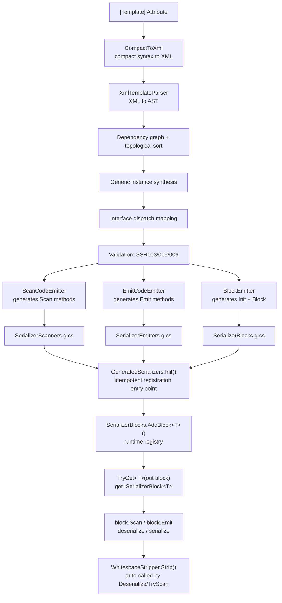
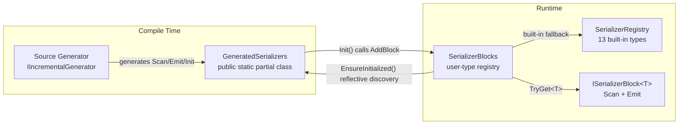

# Core Concepts

Understand the diagrams and concepts on this page, and you understand the entire architecture of SourceSerializer. Each concept maps to a concrete API type: when you are done, jump directly to the [API Reference](/en/api/) for details.

## End-to-End Data Flow

From an attribute declaration to string parsing, SourceSerializer's complete pipeline spans both compile time and runtime:



Three key boundaries in the pipeline:

- **Compile time** (A through M): Roslyn has access to the full type system. `IsUnmanagedType` determines allocation strategy, `AllInterfaces` auto-matches collection types, `IMethodSymbol.Parameters` discovers constructors. All decisions happen at compile time: zero runtime guessing.
- **Initialization** (N through O): `EnsureInitialized()` reflectively scans all loaded assemblies, automatically discovering and invoking each assembly's `GeneratedSerializers.Init()`. Subsequent calls return immediately via the `_initCalled` guard.
- **Runtime** (O through Q): `TryGet<T>` fetches `ISerializerBlock<T>` from the registry. `Scan` and `Emit` are generated pure C# methods: no reflection, no boxing.

## Key Type Relationships



`GeneratedSerializers` is the merge point for all three SG output files: `SerializerScanners.g.cs` contributes `Scan_Xxx` methods, `SerializerEmitters.g.cs` contributes `Emit_Xxx` methods, and `SerializerBlocks.g.cs` contributes the `Init()` registration entry point and `Block_Xxx` wrapper structs. Three `partial class` declarations merge into one class at compile time.

`SerializerBlocks` is the central runtime registration point. All user types (SG-generated or hand-written) register via `AddBlock<T>` and are queried via `TryGet<T>`. `SerializerRegistry` provides zero-allocation span scanners for the 13 built-in types, serving as a fallback when `TryGet<T>` does not match.

## Lifecycle of a Template

Using `Point2D` as an example: from declaration to parsing, five stages.

### 1. Declaration

The user adds an attribute to a struct:

```csharp
[Template("Point2D(<float X>, <float Y>)")]
public struct Point2D
{
    public float X;
    public float Y;
}
```

### 2. Compile Time

Roslyn triggers `SerializerGenerator` (`IIncrementalGenerator`). The pipeline executes in order:

1. `CompactToXml` converts compact syntax to XML
2. `XmlTemplateParser` parses XML into an AST node tree
3. Dependency graph topological sort (if `Point2D` references other types, generate referenced types first)
4. Generic instance synthesis (`Point2D` is not generic; skipped)
5. Interface dispatch mapping (`Point2D` implements no interfaces; skipped)
6. Validation passes (fields `X` and `Y` are both `float`, a built-in type; no readonly conflicts)
7. Three emitters each generate their output

Three `.g.cs` files are produced, all contributing to `public static partial class GeneratedSerializers`:

```csharp
// SerializerScanners.g.cs: deserialization
public static int Scan_Point2D(ReadOnlySpan<char> t, int p, out Point2D v) { ... }

// SerializerEmitters.g.cs: serialization
public static void Emit_Point2D(StringBuilder sb, Point2D v) { ... }

// SerializerBlocks.g.cs: registration entry point
public static void Init()
{
    SerializerBlocks.AddBlock(new Block_Point2D());
    // ... other types
}
```

### 3. Initialization

The first time user code calls `TryGet<Point2D>`, `EnsureInitialized()` reflectively scans all loaded assemblies for `GeneratedSerializers.Init()` and invokes each one. `Init()` internally calls `SerializerBlocks.AddBlock<T>(new Block_T())` to register all SG-generated types. Built-in type scanners are registered afterward. The entire process is automatic: the user does nothing.

### 4. Acquisition

```csharp
SerializerBlocks.TryGet<Point2D>(out var block);
// block is ISerializerBlock<Point2D>, internally wrapping Scan_Point2D and Emit_Point2D
```

If `Point2D`'s SG-generated code is in the current assembly: compile-time `Init()` already registered it. If `Point2D` is in a hot-reload DLL: call `GeneratedSerializers.Init()` explicitly after loading. Interface types use the `ChainBlock<T>` chain merge path.

### 5. Usage

```csharp
// Deserialization
block.Scan("Point2D(3.5, -2.1)".AsSpan(), 0, out Point2D v);
// v.X == 3.5f, v.Y == -2.1f

// Serialization
var sb = new StringBuilder();
block.Emit(sb, new Point2D { X = 3.5f, Y = -2.1f });
// sb.ToString() == "Point2D(3.5, -2.1)"
```

## Two Registries

SourceSerializer has two registries with complementary responsibilities:

| | SerializerRegistry | SerializerBlocks |
|------|------|------|
| Registered content | `Scan_Xxx` / `Emit_Xxx` methods for 13 built-in types | `ISerializerBlock<T>` implementations for user types |
| Who writes | Library code, fixed at compile time | SG at compile time + hot-reload DLLs at runtime |
| How to access | Direct static call: `SerializerRegistry.Scan_Float(text, pos, out val)` | `SerializerBlocks.TryGet<T>(out block)` |
| Extensible | No | Yes (`AddBlock` / `RemoveBlock` / `AddBlocks`) |
| Purpose | Provides "atomic type" scanners for the SG pipeline; all user templates ultimately resolve to built-in Scan/Emit calls | Cross-assembly registration hub, decoupling SG output from user invocation |

The built-in `Scan_Xxx` methods are the "leaf nodes" of SG-generated code: `Scan_Point2D` internally calls `Scan_Float` (twice) plus literal matching. All `SerializerRegistry` methods are `public static` and can be called directly by both SG-generated code and hand-written `ISerializerBlock<T>` implementations.

## Standalone Mode

`GeneratedSerializers` is a `public static partial class`, fully decoupled from `SerializerRegistry` (non-partial, pure library code). This design solves a key problem:

SG-generated code exists independently in the **package assembly** (`SourceSerializer.Runtime`) and the **user assembly** (the user's Unity project or .NET project). If `SerializerBlocks.TryGet<T>` relied on a static dictionary in the package assembly, entries stored by the user-side `Store<T>` would be invisible to the package-side lookup.

`GeneratedSerializers` bridges the two sides as a `public` standalone class:

- `Init()` is idempotent: the `_initCalled` guard field makes subsequent calls no-ops
- `EnsureInitialized()` reflectively discovers and invokes `GeneratedSerializers.Init()` across all loaded assemblies
- Hot-reload DLLs call their own `GeneratedSerializers.Init()` explicitly: they were not present during the initial scan

```csharp
// Main assembly: automatic
SerializerBlocks.TryGet<Point2D>(out var block); // EnsureInitialized() triggers automatically

// Hot-reload DLL: explicit call
var asm = Assembly.LoadFrom("hotfix.dll");
var init = asm.GetType("SourceSerializer.GeneratedSerializers")
              .GetMethod("Init");
init.Invoke(null, null); // registers all types in the DLL
```

## Next Steps

- [Getting Started](./getting-started): start here if you have not yet
- [Template Syntax](./template-syntax): the five primitives, built-in types, collection formats
- [SG Pipeline Overview](../technical/pipeline/overview): deep dive into the compile-time pipeline
- [API Reference](/en/api/): all attributes and runtime API
