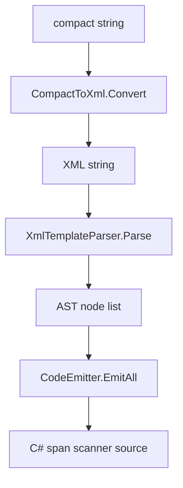

# Template Syntax

SourceSerializer supports two equivalent template formats: compact and XML. The source generator translates compact syntax to XML at compile time, then parses it into an AST.

## Compact Format

Fields are declared with `<type fieldname>`. Literal text is written directly. Best for short templates:

```csharp
[Template("<float Damage>|<optional>draw <int Cards></optional>")]
public struct SpellCard
{
    public float Damage;
    public int Cards;
}
```

Optional and repetition blocks are wrapped with `<optional>...</optional>` and `<repetition>...</repetition>`:

```csharp
[Template("<float Damage><repetition>, <float Multipliers></repetition>")]
public struct DamageData
{
    public float Damage;
    public float Multipliers;
}
```

## XML Format

Equivalent to compact format. Best for multi-line complex templates:

```xml
<literal-template>
  <field type="float" name="Damage"/>
  <text>|</text>
  <optional>
    <text>draw </text>
    <field type="int" name="Cards"/>
  </optional>
</literal-template>
```

## Four Primitives

| Primitive | Compact | XML Element | Semantics |
|-----------|---------|-------------|-----------|
| Literal text | Write directly | `<text>...</text>` | Exact character-by-character match |
| Field | `<type name>` | `<field type="" name=""/>` | Invokes the corresponding type scanner, writes result to field |
| Optional block | `<optional>...</optional>` | `<optional>...</optional>` | Attempts to match inner nodes, rewinds on failure |
| Repetition block | `<repetition>...</repetition>` | `<repetition>...</repetition>` | Loops matching inner nodes, exits loop on failure |

Repetition semantics: the last match writes to the selected field. Each iteration overwrites the same field, keeping only the final value. Suitable for parsing the last element of a variable-length list.

## Nesting

Primitives can be nested arbitrarily. An optional block containing a repetition block:

```xml
<literal-template>
  <field type="float" name="Base"/>
  <optional>
    <text>, bonuses: </text>
    <repetition>
      <text>+</text>
      <field type="float" name="Bonus"/>
    </repetition>
  </optional>
</literal-template>
```

The diagram below shows the parse pipeline:



## Built-in Types

12 C# built-in types are available without extra configuration:

float, double, int, uint, long, ulong, short, ushort, byte, sbyte, bool, char.

Each built-in type has a corresponding zero-allocation span scanner (e.g., `Scan_Float`, `Scan_Int`) provided by `SerializerRegistry`.

## Custom Type Aliases

Register aliases with the assembly-level `[TypeAlias]` attribute:

```csharp
[assembly: TypeAlias("Distance", "float")]
```

Then `<Distance range>` can be used in templates instead of `<float range>`.

## Enum Tags

Use `[Tag]` to declare string tags for enum members. The source generator automatically produces a switch-on-string scanner:

```csharp
enum Element
{
    [Tag("fire")] Fire,
    [Tag("ice")]  Ice,
    [Tag("magic")] Magic,
}

[Template("<Element Type>")]
public struct Spell
{
    public Element Type;
}
```

Input `"fire"` parses to `Element.Fire`. Input `"water"` fails because no tag matches.

## Third-Party Type Templates

Use `[ExternalTemplate]` to declare templates for types without `[Template]`, such as structs from third-party libraries:

```csharp
[ExternalTemplate(typeof(Vector3), "<float x> <float y> <float z>")]
```
