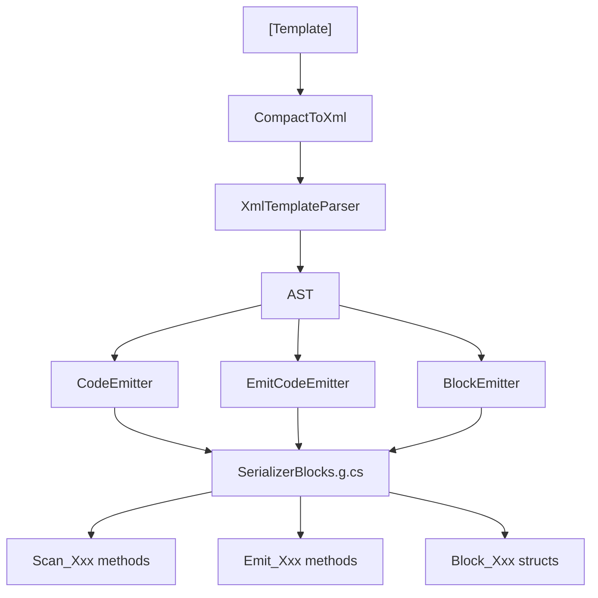

# SG Pipeline Overview

Complete compile-time code generation pipeline for SourceSerializer.

## Stage Diagram

## Stages

| Stage | Input | Output | Purpose |
|-------|-------|--------|---------|
| CompactToXml | Compact syntax string | XML string | `<float X>` → `<field type="float" name="X"/>` |
| XmlTemplateParser | XML string | AST (TemplateNode tree) | Parse XML into LiteralText/Field/Optional/Repetition nodes |
| CodeEmitter | AST | C# scanner source | Generate `Scan_Xxx` span scanner |
| EmitCodeEmitter | AST | C# emitter source | Generate `Emit_Xxx` serializer |
| BlockEmitter | EmitEntry list | `Block_Xxx` structs | Generate per-type `ISerializerBlock<T>` implementation |

## Key Integration Points

- **Generic Resolution**: `ResolveGenericTypeInstances` → `TryResolveViaInterfaces` Roslyn fallback
- **Interface Dispatch**: `interfaceMap` → `EmitInterfaceDispatch` generates longest-prefix-match scanner
- **Dependency Graph**: `BuildDependencyGraph` → topological sort for correct generation order
- **Shared Utilities**: `EmitHelpers` provides `GetMethodName`, `GetUniqueVar`, counter management
