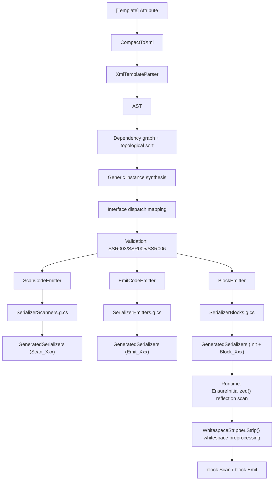

# SG Pipeline Overview

The complete compile-time code generation pipeline of SourceSerializer. The pipeline runs at compile time (Roslyn `IIncrementalGenerator`) and outputs pure C# files with zero runtime dependencies.

## Stage Diagram


```mermaid
flowchart TD
    A["[Template] Attribute"] --> B[CompactToXml]
    B --> C[XmlTemplateParser]
    C --> D[AST]
    D --> E[Dependency graph + topological sort]
    E --> F[Generic instance synthesis]
    F --> G[Interface dispatch mapping]
    G --> H[Validation: SSR003/SSR005/SSR006]
    H --> I[ScanCodeEmitter]
    H --> J[EmitCodeEmitter]
    H --> K[BlockEmitter]
    I --> L[SerializerScanners.g.cs]
    J --> M[SerializerEmitters.g.cs]
    K --> N[SerializerBlocks.g.cs]
    L --> O["GeneratedSerializers (Scan_Xxx)"]
    M --> P["GeneratedSerializers (Emit_Xxx)"]
    N --> Q["GeneratedSerializers (Init + Block_Xxx)"]
    Q --> R["Runtime: EnsureInitialized() reflection scan"]
    R --> S["WhitespaceStripper.Strip() whitespace preprocessing"]
    S --> T["block.Scan / block.Emit"]
```

## Pipeline Stages

| Stage | Input | Output | Responsibility | Design Rationale |
|------|------|------|------|---------|
| CompactToXml | Compact syntax string | XML string | Convert `<float X>` to `<field type="float" name="X"/>` | Compact syntax is the user-friendly layer; XML is the unified AST input format for the SG pipeline. Two-layer separation means syntax sugar changes do not affect AST parsing |
| XmlTemplateParser | XML string | AST (TemplateNode tree) | Parse XML into LiteralText/Field/Optional/Repetition nodes | XML's nested structure naturally expresses the hierarchy of optional/repetition/first/body; reuses `XmlReader` instead of hand-writing a recursive descent parser |
| Dependency graph + topological sort | AST list | Ordered type list | Build dependency graph from field references, topologically sort to ensure nested types are generated first | Nested type templates must be generated before their outer types (B's Scan method references A's Scan method). Topological sort guarantees correct generation order |
| Generic instance synthesis | Open generic templates + field references | Concrete generic struct definitions | Auto-synthesize concrete instances like `List<float>` from default templates | The user only declares `Wrapper<T>`; the SG auto-synthesizes the concrete template when it encounters a `Wrapper<float>` reference. Zero manual per-instance declarations |
| Interface dispatch mapping | ImplementedInterfaces of concrete types | Interface-to-implementations mapping | Collect all implementing types for each interface | Roslyn `AllInterfaces` provides complete type information at compile time; no runtime reflection needed to determine type membership |
| Validation | AST + dependency graph + interface mapping | Diagnostics (SSR003/005/006/007) | Readonly field detection, scalar-in-repetition warning, template ambiguity detection, built-in type ExternalTemplate override detection | All diagnostics are caught at compile time; users never encounter runtime errors from template definition mistakes. `IsUnmanagedType` is the authoritative Roslyn judgment, with zero lines of manual rules |
| compactWhitespace | Template AST | Optimized generated code | Compile-time stripping of whitespace from literal text nodes, reducing string constant size in generated `Scan_Xxx` methods | ScanCodeEmitter option, not user-configurable. Works with runtime `WhitespaceStripper` for fully transparent input whitespace handling |
| ScanCodeEmitter | AST | `SerializerScanners.g.cs` | Generate `Scan_Xxx` span scanners | Scan and Emit share the same AST input but generate methods for opposite directions. Separate emitter classes avoid `if (isEmit)` branching in code generation |
| EmitCodeEmitter | AST | `SerializerEmitters.g.cs` | Generate `Emit_Xxx` serializers with `<indent>` newline+indent injection | Same rationale as above. Write-direction code generation logic (`StringBuilder.Append`, foreach iteration, indentLevel management) is entirely different from read-direction |
| BlockEmitter | EmitEntry list | `SerializerBlocks.g.cs` | Generate `Init()` registration entry point + `Block_Xxx` wrapper structs | Init() registration logic is generated independently: Scanner and Emitter are unaware of the registration mechanism. Three .g.cs files, each with a single responsibility |
| WhitespaceStripper (Runtime) | Raw input string | Compact string | Single-pass runtime stripping of whitespace outside quoted strings (two-pass `string.Create`), auto-invoked in `Deserialize`/`TryScan` | Centralized preprocessing avoids per-type whitespace-skip branches in scanner code. Preserves quoted regions (including `\"` escapes) |

## Output Files

All three `.g.cs` files contribute to `public static partial class GeneratedSerializers` (namespace `SourceSerializer`):

| File | Content |
|------|------|
| `SerializerScanners.g.cs` | `public static int Scan_Xxx(...)` deserialization methods |
| `SerializerEmitters.g.cs` | `public static void Emit_Xxx(...)` serialization methods |
| `SerializerBlocks.g.cs` | `public static void Init()` registration entry point + `public readonly struct Block_Xxx` wrappers |

## SG Pipeline / Runtime Interface

The three `.g.cs` files merge into a single class via `partial class GeneratedSerializers`. The `Init()` method bridges compile-time output with the runtime registry:

```csharp
// Simplified internal logic of Init() generated in SerializerBlocks.g.cs
public static partial class GeneratedSerializers
{
    private static bool _initCalled;

    public static void Init()
    {
        if (_initCalled) return;
        _initCalled = true;

        SerializerBlocks.AddBlock(new Block_Point2D());
        SerializerBlocks.AddBlock(new Block_Vec3());
        SerializerBlocks.AddBlock<IVector>(new Block_IVector()); // interface chain merge
        // ... all [Template] types discovered by the SG
    }
}
```

`SerializerBlocks.EnsureInitialized()` reflectively scans all loaded assemblies on the first `TryGet<T>` call, automatically discovering and invoking every `GeneratedSerializers.Init()`. Built-in types (13 total) register their `BuiltinBlock_*` after the scan completes, serving as a fallback.

**Interface chain merge**: Multiple `AddBlock` calls for the same interface (originating from `Init()` in different assemblies) automatically append to a `ChainBlock<T>` dispatch chain. When a hot-reload DLL calls its own `Init()` after loading, new types are automatically appended to the tail of existing interface chains.

See [Internals](../internals) for the full implementation details of interface dispatch and ChainBlock.

## Design Constraints

- **Roslyn as the single source of truth**: `IsUnmanagedType` determines allocation strategy, `AllInterfaces` matches default collection templates, `IMethodSymbol.Parameters` discovers constructors. All decisions leverage Roslyn's complete type system at compile time, with zero runtime reflection.
- **Zero reflection, zero boxing**: SG-generated method signatures are identical to hand-written `ISerializerBlock<T>` implementations. Callers obtain interface instances via `TryGet<T>` without needing to know whether the type came from SG generation or hand-writing, from the main assembly or a hot-reload DLL.
- **Compile-time / runtime separation**: The SG pipeline outputs pure C# files with no runtime dependencies. `SerializerBlocks` only handles registration and querying, not generation. `SerializerRegistry` only provides atomic methods for built-in types, not registration.

## Relationship with FluxFormula

SourceSerializer originated from FluxFormula's LiteralScanner Source Generator and was extracted as a standalone UPM library in v6.0.0. FluxFormula embeds SourceSerializer's complete SG pipeline in `packages/fluxformula.core/SourceGenerator/`, using it to generate compile-time parsers for literals in formulas (e.g. `42`, `3.5f`). The attribute naming also follows SourceSerializer standards: FluxFormula's `[LiteralTemplate]` was renamed to the standard `[Template]` in v6.0.0.

## Next Steps

- [Internals](../internals): deep details on interface dispatch, ChainBlock chain merge, generic resolution Roslyn fallback, collection emit
- [Architecture Decisions](../architecture-decisions): alternatives considered and trade-offs for key design choices
- [Core Concepts](/en/guide/core-concepts): end-to-end architecture overview, the complete lifecycle from attribute to Scan/Emit
