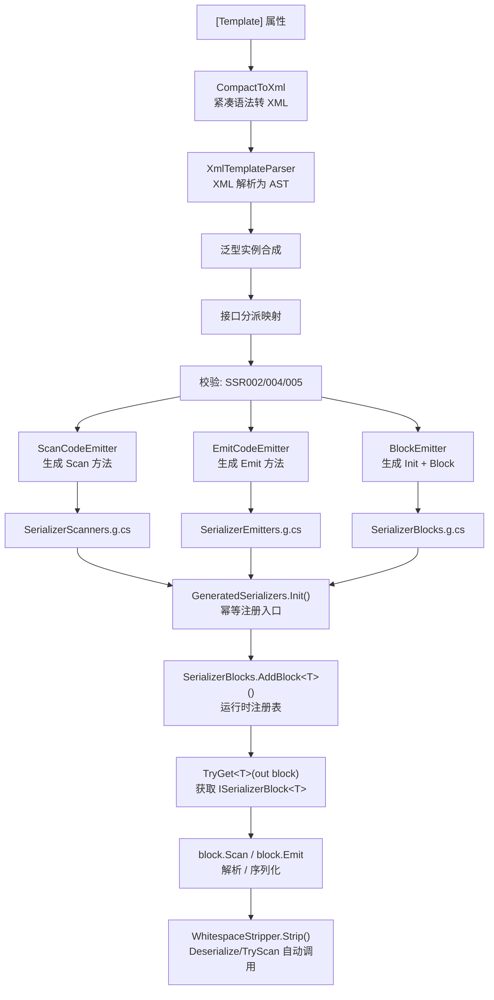
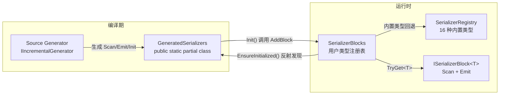

# 核心概念

理解这一页的图和概念，你就理解了 SourceSerializer 的全部核心机制。每个概念都对应一个具体的 API 类型，读完可以直接跳到 [API 参考](/api/) 查细节。

## 端到端数据流

从 attribute 声明到字符串解析，SourceSerializer 的完整管线跨越编译期和运行时两个阶段：



管线的三个关键边界：

- **编译期**（A 到 M）：Roslyn 拥有完整类型系统。`IsUnmanagedType` 判定分配策略，`AllInterfaces` 自动匹配集合类型，`IMethodSymbol.Parameters` 发现构造器。一切判定在编译期完成，零运行时猜测。
- **初始化期**（N 到 O）：`EnsureInitialized()` 反射扫描所有已加载程序集，自动发现并调用每个程序集的 `GeneratedSerializers.Init()`。二次调用由 `_initCalled` 守卫直接返回。
- **运行时**（O 到 Q）：`TryGet<T>` 从注册表获取 `ISerializerBlock<T>`，`Scan` 和 `Emit` 是生成的纯 C# 方法，无反射，无装箱。

## 关键类型关系



`GeneratedSerializers` 是 SG 三文件的汇合点：`SerializerScanners.g.cs` 贡献 `Scan_Xxx` 方法，`SerializerEmitters.g.cs` 贡献 `Emit_Xxx` 方法，`SerializerBlocks.g.cs` 贡献 `Init()` 注册入口和 `Block_Xxx` 包装结构体。三个 `partial class` 声明在编译期合并为一个类。

`SerializerBlocks` 是运行时的中心注册点。所有用户类型（SG 生成的或手写的）通过 `AddBlock<T>` 注册，通过 `TryGet<T>` 查询。`SerializerRegistry` 提供 16 种内置类型的零分配 span 扫描器，作为 `TryGet<T>` 未命中时的回退。

## 一个模板的生命周期

以 `Point2D` 为例，从声明到解析，共五个阶段。

### 1. 声明期

用户在 struct 上加 attribute：

```csharp
[Template("Point2D(<float X>, <float Y>)")]
public struct Point2D
{
    public float X;
    public float Y;
}
```

### 2. 编译期

Roslyn 触发 `SerializerGenerator`（`IIncrementalGenerator`）。管线依次执行：

1. `CompactToXml` 将紧凑语法转 XML
2. `XmlTemplateParser` 解析 XML 为 AST 节点树
3. 泛型实例合成（`Point2D` 不是泛型，跳过）
4. 接口分派映射（`Point2D` 未实现接口，跳过）
5. 校验通过（字段 `X` 和 `Y` 均为 `float`，是内置类型，无 readonly 冲突）
7. 三个 emitter 各自生成代码

产出三份 `.g.cs` 文件，全部贡献到 `public static partial class GeneratedSerializers`：

```csharp
// SerializerScanners.g.cs: 反序列化
public static int Scan_Point2D(ReadOnlySpan<char> t, int p, out Point2D v) { ... }

// SerializerEmitters.g.cs: 序列化
public static void Emit_Point2D(StringBuilder sb, Point2D v) { ... }

// SerializerBlocks.g.cs: 注册入口
public static void Init()
{
    SerializerBlocks.AddBlock(new Block_Point2D());
    // ... 其他类型
}
```

### 3. 初始化期

用户代码首次调用 `TryGet<Point2D>` 时，`EnsureInitialized()` 通过 AppDomain 反射扫描所有已加载程序集的 `GeneratedSerializers.Init()`，并调用每个 `Init()`。`Init()` 内部调用 `SerializerBlocks.AddBlock<T>(new Block_T())` 注册所有 SG 生成的类型。内置类型扫描器随后注册。整个过程自动完成，用户无需手动干预。

### 4. 获取期

```csharp
SerializerBlocks.TryGet<Point2D>(out var block);
// block 是 ISerializerBlock<Point2D>，内部包装了 Scan_Point2D 和 Emit_Point2D
```

如果 `Point2D` 的 SG 生成代码在当前程序集：编译期 `Init()` 已完成注册。如果 `Point2D` 在热更 DLL 中：DLL 加载后显式调用 `GeneratedSerializers.Init()` 即可完成注册。接口类型走 `ChainBlock<T>` 链合并路径。

### 5. 使用期

```csharp
// 反序列化
block.Scan("Point2D(3.5, -2.1)".AsSpan(), 0, out Point2D v);
// v.X == 3.5f, v.Y == -2.1f

// 序列化
var sb = new StringBuilder();
block.Emit(sb, new Point2D { X = 3.5f, Y = -2.1f });
// sb.ToString() == "Point2D(3.5, -2.1)"
```

直接调用 `block.Scan` 时，输入 blank 不会被自动剔除——如果需要空白符容忍，应使用便捷方法 `Deserialize<T>()` 或 `TryScan<T>()`，它们在调用 `Scan` 前自动执行 `WhitespaceStripper.Strip()`，使得调用方无需关心输入中的空白符。

```csharp
// 便捷方法：自动空白符剔除
Point2D v = SerializerBlocks.Deserialize<Point2D>("  Point2D( 3.5 ,  -2.1 )  ");
// 等价于直接调用 block.Scan 但无需手动 Strip
```

## 两个注册表

SourceSerializer 有两个注册表，职责互补：

| | SerializerRegistry | SerializerBlocks |
|------|------|------|
| 注册内容 | 16 种内置类型的 `Scan_Xxx` / `Emit_Xxx` 方法 | 用户类型的 `ISerializerBlock<T>` 实现 |
| 谁写入 | 库代码，编译期固定 | SG 编译期生成 + 热更 DLL 运行时注册 |
| 如何获取 | 直接调用静态方法：`SerializerRegistry.Scan_Float(text, pos, out val)` | `SerializerBlocks.TryGet<T>(out block)` |
| 可扩展 | 否 | 是（`AddBlock` / `RemoveBlock` / `AddBlocks`） |
| 设计目的 | 提供 SG 管线所需的"原子类型"扫描器，所有用户模板最终落到内置类型的 Scan/Emit 调用 | 作为跨程序集的注册中心，解耦 SG 产出和用户调用 |

内置类型的 `Scan_Xxx` 方法是 SG 生成代码的"叶子节点"：`Scan_Point2D` 内部调用 `Scan_Float`（两次）和文字匹配。`SerializerRegistry` 的方法全部是 `public static`，SG 生成代码和手写 `ISerializerBlock<T>` 实现均可直接调用。

## Standalone 模式

`GeneratedSerializers` 是一个 `public static partial class`，与 `SerializerRegistry`（非 partial，纯库代码）完全解耦。这种设计解决了一个关键问题：

SG 生成的代码在**包程序集**（`SourceSerializer.Runtime`）和**用户程序集**（用户的 Unity 项目或 .NET 项目）中各自独立存在。如果 `SerializerBlocks` 的 `TryGet<T>` 依赖包侧的静态字典，用户侧的 `Store<T>` 存入的条目在包侧查不到。

`GeneratedSerializers` 作为 `public` 独立类，通过以下机制桥接两边：

- `Init()` 是幂等的：`_initCalled` 守卫字段保证二次调用直接返回
- `EnsureInitialized()` 通过 AppDomain 反射自动扫描所有已加载程序集的 `GeneratedSerializers.Init()`
- 热更 DLL 加载后显式调用自身的 `GeneratedSerializers.Init()`：因为它在首次扫描之后才被加载

```csharp
// 主程序集: 自动
SerializerBlocks.TryGet<Point2D>(out var block); // EnsureInitialized() 自动触发

// 热更 DLL: 显式调用
var asm = Assembly.LoadFrom("hotfix.dll");
var init = asm.GetType("SourceSerializer.GeneratedSerializers")
              .GetMethod("Init");
init.Invoke(null, null); // 注册 DLL 内的所有类型
```

## 下一步

- [快速入门](./getting-started): 如果还没看过，从这里开始
- [模板语法](./template-syntax): 四种原语、内置类型、集合格式
- [SG 管线全景](../technical/pipeline/overview): 深入编译期管线各阶段
- [API 参考](/api/): 所有 attribute 和运行时 API
