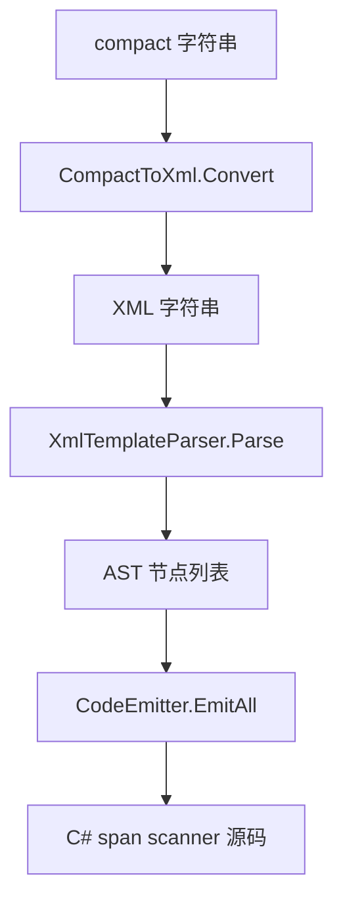

# 模板语法

SourceSerializer 支持两种等价的模板书写格式：compact 格式和 XML 格式。source generator 在编译期将 compact 格式翻译为 XML，再解析为 AST。

## Compact 格式

字段用 `<类型 字段名>` 声明，文字直接书写。适合短模板：

```csharp
[Template("SpellCard(<float Damage><optional>, draw <int Cards></optional>)")]
public struct SpellCard
{
    public float Damage;
    public int Cards;
}
```

可选块与重复块使用 `<optional>...</optional>` 和 `<repetition>...</repetition>` 包裹：

```csharp
[Template("DamageData(<float Damage><repetition>, <float Multipliers></repetition>)")]
public struct DamageData
{
    public float Damage;
    public float Multipliers;
}
```

## XML 格式

等价于 compact 格式，适合多行复杂模板：

```xml
<literal-template>
  <field type="float" name="Damage"/>
  <text>|</text>
  <optional>
    <text>draw </text>
    <field type="int" name="Cards"/>
  </optional>
</literal-template>
```

## 四种原语

| 原语 | Compact 写法 | XML 元素 | 语义 |
|------|-------------|---------|------|
| 裸文字 | 直接书写 | `<text>...</text>` | 逐字符精确匹配 |
| 字段 | `<type name>` | `<field type="" name=""/>` | 调用对应类型扫描器，结果写入 name 字段 |
| 可选块 | `<optional>...</optional>` | `<optional>...</optional>` | 尝试匹配内部节点，失败回退继续 |
| 重复块 | `<repetition>...</repetition>` | `<repetition>...</repetition>` | 循环匹配内部节点，失败退出循环 |

重复块的语义："匹配最后一次写入选定字段"。同一字段每轮迭代被覆盖，最终保留最后一轮的值。适合解析变长列表的最后一个元素。

## 嵌套

原语可以任意嵌套。以下是可选块内嵌重复块的示例：

```xml
<literal-template>
  <field type="float" name="Base"/>
  <optional>
    <text>, bonuses: </text>
    <repetition>
      <text>+</text>
      <field type="float" name="Bonus"/>
    </repetition>
  </optional>
</literal-template>
```

下图展示了解析流程：



## 内置类型

13 种 C# 内置类型直接可用，无需额外配置：

float、double、int、uint、long、ulong、short、ushort、byte、sbyte、bool、char、string。

每个内置类型有对应的零分配 span 扫描器（如 `Scan_Float`、`Scan_Int`），由 `SerializerRegistry` 提供。

## 集合序列化格式

内置集合模板使用函数式包裹格式，支持任意深度嵌套：

| 集合类型 | 序列化格式 | 示例 |
|---------|-----------|------|
| `List<T>` / `T[]` | `List(...)` | `List(1.5, 2.0, 3.5)` |
| `HashSet<T>` | `HashSet(...)` | `HashSet(100, 200)` |
| `Dictionary<K,V>` | `Dict(...)` | `Dict(Fire: 10, Ice: 5)` |
| 嵌套集合 | 递归包裹 | `List(List(1,2), List(3,4))` |
| 空集合 | `List()` | `List()` |

字符串值在序列化时始终加引号（`"hello world"`），反序列化时兼容有/无引号两种输入。

## 自定义类型别名

用 assembly 级 `[TypeAlias]` 注册别名：

```csharp
[assembly: TypeAlias("Distance", "float")]
```

之后模板中可用 `<Distance range>` 替代 `<float range>`。

## 枚举标签

用 `[Tag]` 为枚举成员声明字符串标签。source generator 自动生成 switch-on-string 扫描器：

```csharp
enum Element
{
    [Tag("fire")] Fire,
    [Tag("ice")]  Ice,
    [Tag("magic")] Magic,
}

[Template("Spell(<Element Type>)")]
public struct Spell
{
    public Element Type;
}
```

输入 `"fire"` 将解析为 `Element.Fire`，`"water"` 因无匹配标签而解析失败。

## 第三方类型模板

用 `[ExternalTemplate]` 为未标记 `[Template]` 的类型（如第三方库中的 struct）声明模板。

## 不参与序列化的字段

如果 struct 包含不应参与序列化的字段（缓存、内部状态），用 `[TemplateIgnore]` 标记。被标记的字段不出现在模板字符串中，也不会触发 SSR004 错误。详见[编译期诊断](./diagnostics#使用-templateignore-忽略字段)。

```csharp
[Template("Stats(<float Value>)")]
public struct Stats
{
    public float Value;
    [TemplateIgnore] public CacheData InternalCache;
}
```

## 第三方类型模板

用 `[ExternalTemplate]` 为未标记 `[Template]` 的类型（如第三方库中的 struct）声明模板：

```csharp
[ExternalTemplate(typeof(Vector3), "Vector3(<float x>, <float y>, <float z>)")]
```

## 泛型集合自动解析

当字段类型为 `List<T>` 或 `Dictionary<K,V>` 时，source generator 自动从内置的开放泛型模板合成解析器。调用方无需为集合类型手动编写 `[Template]`。

`List<T>` 的合成模板解析逗号分隔的元素序列，每个元素按元素类型的模板解析。`Dictionary<K,V>` 解析 `key: value` 对序列。

```csharp
// 元素类型
[Template("NamedValue(<float Value>)")]
public struct NamedValue
{
    public float Value;
}

// 集合字段自动解析
[Template("Container(<repetition>, <List<NamedValue> Items></repetition>)")]
public struct Container
{
    public List<NamedValue> Items;
}
```

集合类型的字段赋值使用 `.Add()` 而非 `=`，因此解析多个元素时所有值都被保留到列表中。标量字段在 `<repetition>` 块中每次迭代被覆盖，会触发 [SSR005 诊断](./diagnostics#ssr005重复块内的标量字段)。
