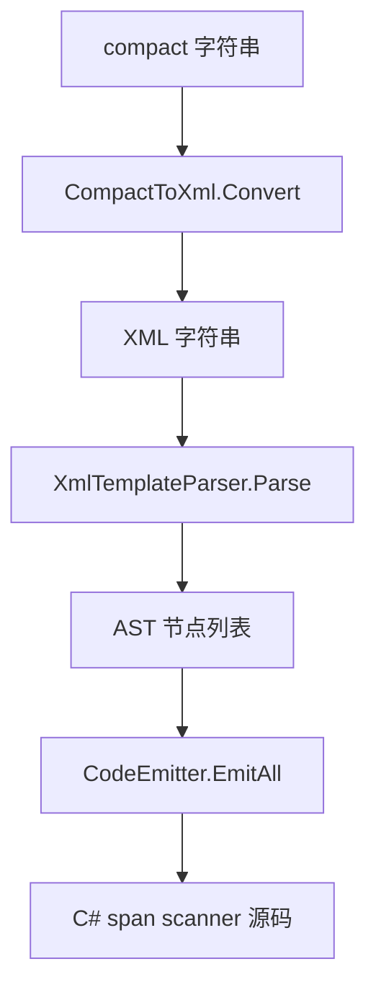

# 模板语法

SourceSerializer 支持两种等价的模板书写格式：compact 格式和 XML 格式。source generator 在编译期将 compact 格式翻译为 XML，再解析为 AST。

## Compact 格式

字段用 `<类型 字段名>` 声明，文字直接书写。适合短模板：

```csharp
[Template("<float Damage>|<optional>draw <int Cards></optional>")]
public struct SpellCard
{
    public float Damage;
    public int Cards;
}
```

可选块与重复块使用 `<optional>...</optional>` 和 `<repetition>...</repetition>` 包裹：

```csharp
[Template("<float Damage><repetition>, <float Multipliers></repetition>")]
public struct DamageData
{
    public float Damage;
    public float Multipliers;
}
```

## XML 格式

等价于 compact 格式，适合多行复杂模板：

```xml
<literal-template>
  <field type="float" name="Damage"/>
  <text>|</text>
  <optional>
    <text>draw </text>
    <field type="int" name="Cards"/>
  </optional>
</literal-template>
```

## 四种原语

| 原语 | Compact 写法 | XML 元素 | 语义 |
|------|-------------|---------|------|
| 裸文字 | 直接书写 | `<text>...</text>` | 逐字符精确匹配 |
| 字段 | `<type name>` | `<field type="" name=""/>` | 调用对应类型扫描器，结果写入 name 字段 |
| 可选块 | `<optional>...</optional>` | `<optional>...</optional>` | 尝试匹配内部节点，失败回退继续 |
| 重复块 | `<repetition>...</repetition>` | `<repetition>...</repetition>` | 循环匹配内部节点，失败退出循环 |

重复块的语义："匹配最后一次写入选定字段"。同一字段每轮迭代被覆盖，最终保留最后一轮的值。适合解析变长列表的最后一个元素。

## 嵌套

原语可以任意嵌套。以下是可选块内嵌重复块的示例：

```xml
<literal-template>
  <field type="float" name="Base"/>
  <optional>
    <text>, bonuses: </text>
    <repetition>
      <text>+</text>
      <field type="float" name="Bonus"/>
    </repetition>
  </optional>
</literal-template>
```

下图展示了解析流程：



## 内置类型

12 种 C# 内置类型直接可用，无需额外配置：

float、double、int、uint、long、ulong、short、ushort、byte、sbyte、bool、char。

每个内置类型有对应的零分配 span 扫描器（如 `Scan_Float`、`Scan_Int`），由 `SerializerRegistry` 提供。

## 自定义类型别名

用 assembly 级 `[TypeAlias]` 注册别名：

```csharp
[assembly: TypeAlias("Distance", "float")]
```

之后模板中可用 `<Distance range>` 替代 `<float range>`。

## 枚举标签

用 `[Tag]` 为枚举成员声明字符串标签。source generator 自动生成 switch-on-string 扫描器：

```csharp
enum Element
{
    [Tag("fire")] Fire,
    [Tag("ice")]  Ice,
    [Tag("magic")] Magic,
}

[Template("<Element Type>")]
public struct Spell
{
    public Element Type;
}
```

输入 `"fire"` 将解析为 `Element.Fire`，`"water"` 因无匹配标签而解析失败。

## 第三方类型模板

用 `[ExternalTemplate]` 为未标记 `[Template]` 的类型（如第三方库中的 struct）声明模板：

```csharp
[ExternalTemplate(typeof(Vector3), "<float x> <float y> <float z>")]
```
