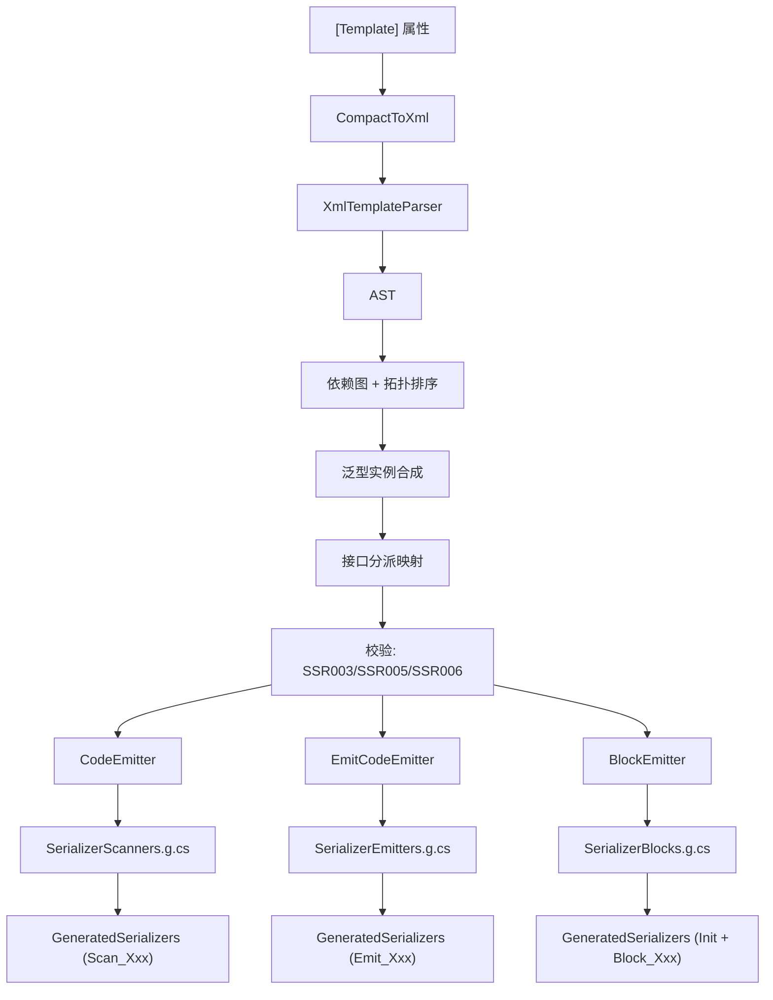

# SG 管线全景

SourceSerializer 的完整编译期代码生成管线。

## 阶段图

## 各阶段

| 阶段 | 输入 | 输出 | 职责 |
|------|------|------|------|
| CompactToXml | 紧凑语法字符串 | XML 字符串 | `<float X>` → `<field type="float" name="X"/>` |
| XmlTemplateParser | XML 字符串 | AST（TemplateNode 树） | 解析 XML 为 LiteralText/Field/Optional/Repetition 节点 |
| 依赖图 + 拓扑排序 | AST 列表 | 有序类型列表 | 按字段引用构建依赖图，拓扑排序确保嵌套类型先生成 |
| 泛型实例合成 | 开放泛型模板 + 字段引用 | 具体泛型 struct 定义 | `List<float>` 等具体实例基于默认模板自动合成 |
| 接口分派映射 | 具现类型的 ImplementedInterfaces | 接口→具现列表映射 | 为每个接口收集所有实现类型 |
| 校验 | AST + 依赖图 + 接口映射 | 诊断 (SSR003/005/006) | readonly 字段、标量重复、模板歧义检测 |
| CodeEmitter | AST | `SerializerScanners.g.cs` | 生成 `Scan_Xxx` span 扫描器 → `GeneratedSerializers` |
| EmitCodeEmitter | AST | `SerializerEmitters.g.cs` | 生成 `Emit_Xxx` 序列化器 → `GeneratedSerializers` |
| BlockEmitter | EmitEntry 列表 | `SerializerBlocks.g.cs` | 生成 `Init()` 注册入口 + `Block_Xxx` 包装结构体 → `GeneratedSerializers` |

## 输出文件

三个 `.g.cs` 文件均贡献到 `public static partial class GeneratedSerializers`（同命名空间 `SourceSerializer`）：

| 文件 | 内容 |
|------|------|
| `SerializerScanners.g.cs` | `public static int Scan_Xxx(...)` 反序列化方法 |
| `SerializerEmitters.g.cs` | `public static void Emit_Xxx(...)` 序列化方法 |
| `SerializerBlocks.g.cs` | `public static void Init()` 注册入口 + `public readonly struct Block_Xxx` 包装器 |

## ElmAF 介入点

- **运行时注册**：`SerializerBlocks.EnsureInitialized()` 反射扫描所有程序集的 `GeneratedSerializers.Init()`
- **接口链合并**：`ChainBlock<T>` 对接口类型的多次 `AddBlock` 做链式追加
- **泛型解析**：`TryResolveViaInterfaces` Roslyn 回退
- **共享工具**：`EmitHelpers` 提供 `GetMethodName`、`GetUniqueVar`、计数器管理
