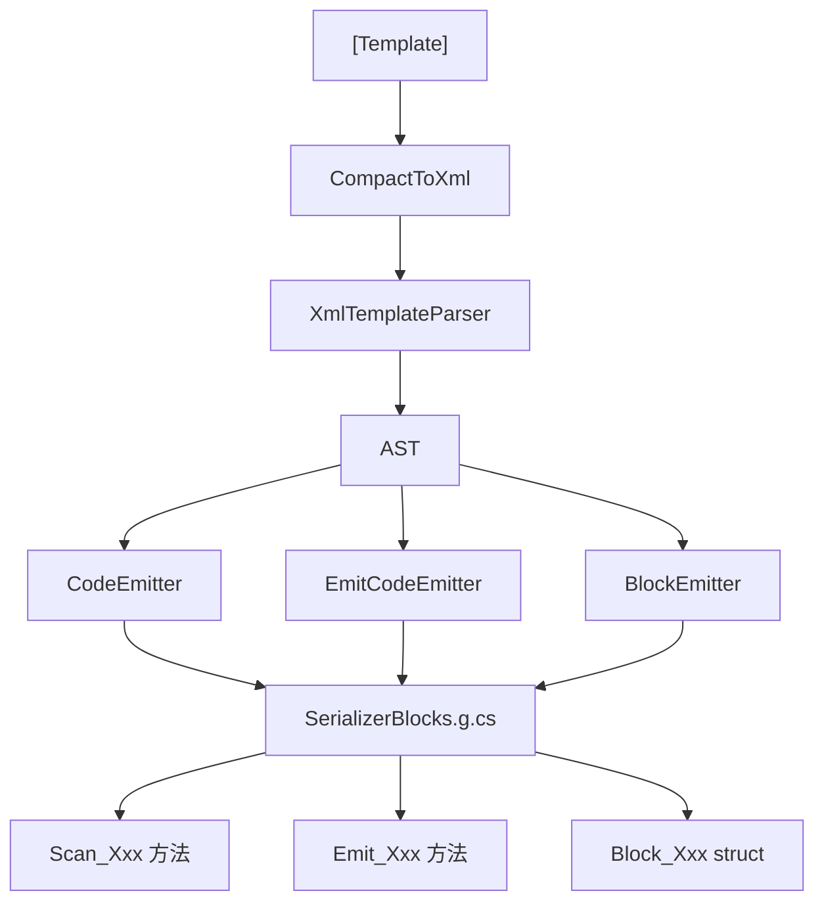

# SG 管线全景

SourceSerializer 的完整编译期代码生成管线。

## 阶段图

## 各阶段

| 阶段 | 输入 | 输出 | 职责 |
|------|------|------|------|
| CompactToXml | 紧凑语法字符串 | XML 字符串 | `<float X>` → `<field type="float" name="X"/>` |
| XmlTemplateParser | XML 字符串 | AST（TemplateNode 树） | 解析 XML，构建 LiteralText/Field/Optional/Repetition 节点 |
| CodeEmitter | AST | C# 扫描方法源码 | 生成 `Scan_Xxx` span 扫描器 |
| EmitCodeEmitter | AST | C# 发射方法源码 | 生成 `Emit_Xxx` 序列化器 |
| BlockEmitter | EmitEntry 列表 | `Block_Xxx` 结构体 | 为每个类型生成 `ISerializerBlock<T>` 实现 |

## ElmAF 介入点

- **泛型解析**：`ResolveGenericTypeInstances` → 走 `TryResolveViaInterfaces` Roslyn 回退
- **接口分派**：`interfaceMap` → `EmitInterfaceDispatch` 生成最长前缀匹配扫描器
- **依赖图**：`BuildDependencyGraph` → 拓扑排序 → 保证嵌套类型的生成顺序
- **共享工具**：`EmitHelpers` 提供 `GetMethodName`、`GetUniqueVar`、计数器管理
