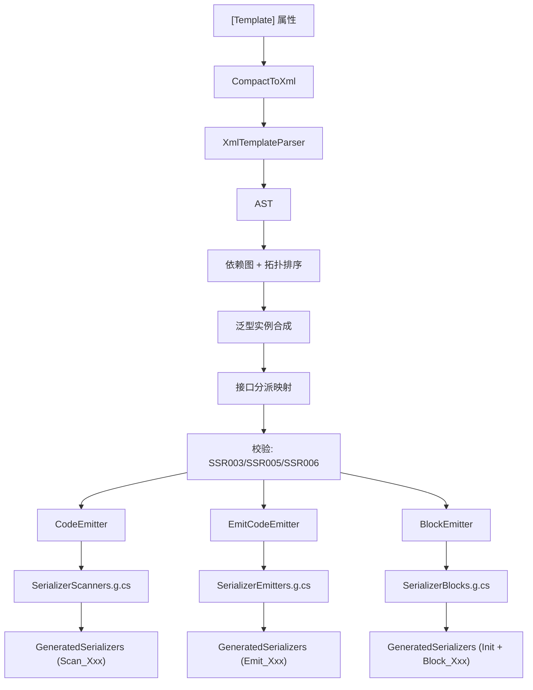

# SG 管线全景

SourceSerializer 的完整编译期代码生成管线。管线在编译期运行（Roslyn `IIncrementalGenerator`），输出纯 C# 文件，运行时零依赖。

## 阶段图


```mermaid
flowchart TD
    A["[Template] 属性"] --> B[CompactToXml]
    B --> C[XmlTemplateParser]
    C --> D[AST]
    D --> E[依赖图 + 拓扑排序]
    E --> F[泛型实例合成]
    F --> G[接口分派映射]
    G --> H[校验: SSR003/SSR005/SSR006]
    H --> I[CodeEmitter]
    H --> J[EmitCodeEmitter]
    H --> K[BlockEmitter]
    I --> L[SerializerScanners.g.cs]
    J --> M[SerializerEmitters.g.cs]
    K --> N[SerializerBlocks.g.cs]
    L --> O["GeneratedSerializers (Scan_Xxx)"]
    M --> P["GeneratedSerializers (Emit_Xxx)"]
    N --> Q["GeneratedSerializers (Init + Block_Xxx)"]
```

## 各阶段

| 阶段 | 输入 | 输出 | 职责 | 设计原因 |
|------|------|------|------|---------|
| CompactToXml | 紧凑语法字符串 | XML 字符串 | `<float X>` 转为 `<field type="float" name="X"/>` | 紧凑语法是用户友好层；XML 是 SG 管线的统一 AST 输入格式。两层分离使语法糖的修改不影响 AST 解析 |
| XmlTemplateParser | XML 字符串 | AST（TemplateNode 树） | 解析 XML 为 LiteralText/Field/Optional/Repetition 节点 | XML 的嵌套结构天然表达 optional/repetition/first/body 的层级关系；复用 `XmlReader` 无需手写递归下降 |
| 依赖图 + 拓扑排序 | AST 列表 | 有序类型列表 | 按字段引用构建依赖图，拓扑排序确保嵌套类型先生成 | 嵌套类型的模板必须先于外层类型生成（B 引用 A 的 Scan 方法需要 A 先生成）。拓扑排序保证生成顺序正确 |
| 泛型实例合成 | 开放泛型模板 + 字段引用 | 具体泛型 struct 定义 | `List<float>` 等具体实例基于默认模板自动合成 | 用户只声明 `Wrapper<T>`，SG 在遇到 `Wrapper<float>` 引用时自动合成具体模板。零手动声明每个具体实例 |
| 接口分派映射 | 具现类型的 ImplementedInterfaces | 接口到具现列表的映射 | 为每个接口收集所有实现类型 | Roslyn `AllInterfaces` 在编译期提供完整类型信息；运行时无需反射判断类型归属 |
| 校验 | AST + 依赖图 + 接口映射 | 诊断 (SSR003/005/006) | readonly 字段检测、标量在 repetition 内警告、模板歧义检测 | 全部诊断在编译期拦截，用户不会等到运行时才发现模板定义错误。`IsUnmanagedType` 是 Roslyn 权威判定，零行手动规则 |
| CodeEmitter | AST | `SerializerScanners.g.cs` | 生成 `Scan_Xxx` span 扫描器 | Scan 和 Emit 共享同一 AST 输入但生成不同方向的方法体。分离 emitter 类避免代码生成时 `if (isEmit)` 分支污染 |
| EmitCodeEmitter | AST | `SerializerEmitters.g.cs` | 生成 `Emit_Xxx` 序列化器 | 同上。回写方向的代码生成逻辑（`StringBuilder.Append`、foreach 迭代）与读取方向完全不同 |
| BlockEmitter | EmitEntry 列表 | `SerializerBlocks.g.cs` | 生成 `Init()` 注册入口 + `Block_Xxx` 包装结构体 | Init() 注册逻辑独立生成：Scanner 和 Emitter 不感知注册机制。三个 .g.cs 文件各司其职 |

## 输出文件

三个 `.g.cs` 文件均贡献到 `public static partial class GeneratedSerializers`（同命名空间 `SourceSerializer`）：

| 文件 | 内容 |
|------|------|
| `SerializerScanners.g.cs` | `public static int Scan_Xxx(...)` 反序列化方法 |
| `SerializerEmitters.g.cs` | `public static void Emit_Xxx(...)` 序列化方法 |
| `SerializerBlocks.g.cs` | `public static void Init()` 注册入口 + `public readonly struct Block_Xxx` 包装器 |

## SG 管线与 Runtime 的接口

三个 `.g.cs` 文件通过 `partial class GeneratedSerializers` 汇集为同一个类。`Init()` 方法桥接编译期产物与运行时注册表：

```csharp
// SerializerBlocks.g.cs 生成的 Init() 内部逻辑（简化）
public static partial class GeneratedSerializers
{
    private static bool _initCalled;

    public static void Init()
    {
        if (_initCalled) return;
        _initCalled = true;

        SerializerBlocks.AddBlock(new Block_Point2D());
        SerializerBlocks.AddBlock(new Block_Vec3());
        SerializerBlocks.AddBlock<IVector>(new Block_IVector()); // 接口链合并
        // ... 所有 SG 扫描到的 [Template] 类型
    }
}
```

`SerializerBlocks.EnsureInitialized()` 在首次 `TryGet<T>` 时通过 AppDomain 反射扫描所有已加载程序集，自动发现并调用所有 `GeneratedSerializers.Init()`。内置类型（13 种）的 `BuiltinBlock_*` 在扫描完成后注册，作为回退。

**接口类型的链合并**：同一接口的多次 `AddBlock` 调用（来自不同程序集的 `Init()`）自动追加到 `ChainBlock<T>` 分发链。热更 DLL 加载后调用自身的 `Init()`，新类型自动追加到已有接口链尾。

详见 [内部机制](../internals) 中的接口分派和 ChainBlock 完整实现细节。

## 设计约束

- **Roslyn 作为唯一真理来源**：`IsUnmanagedType` 判定分配策略，`AllInterfaces` 匹配默认集合模板，`IMethodSymbol.Parameters` 发现构造器。全部在编译期利用 Roslyn 的完整类型系统，零运行时反射。
- **零反射零装箱**：SG 生成的方法签名和手写的 `ISerializerBlock<T>` 接口完全一致。调用方通过 `TryGet<T>` 获取接口实例，不需要知道类型来自 SG 还是手写，来自主程序集还是热更 DLL。
- **编译期-运行时分离**：SG 管线输出纯 C# 文件，无运行时依赖。`SerializerBlocks` 只做注册和查询，不做生成。`SerializerRegistry` 只提供内置类型的原子方法，不做注册。

## 与 FluxFormula 的关系

SourceSerializer 源自 FluxFormula 的 LiteralScanner Source Generator，v6.0.0 独立为通用 UPM 库。FluxFormula 在 `packages/fluxformula.core/SourceGenerator/` 中嵌入 SourceSerializer 的完整 SG 管线，用于公式中字面量（如 `42`、`3.5f`）的编译期解析器生成。属性命名也沿用了 SourceSerializer 的标准：FluxFormula 的 `[LiteralTemplate]` 已在 v6.0.0 重命名为 SourceSerializer 标准的 `[Template]`。

## 下一步

- [内部机制](../internals): 接口分派、ChainBlock 链合并、泛型解析 Roslyn 回退、集合 emit 的深入细节
- [架构决策记录](../architecture-decisions): 关键设计的方案对比与取舍
- [核心概念](/guide/core-concepts): 端到端架构全景，从 attribute 到 Scan/Emit 的完整生命周期
